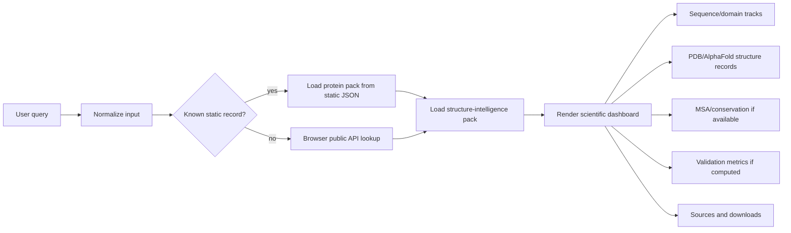
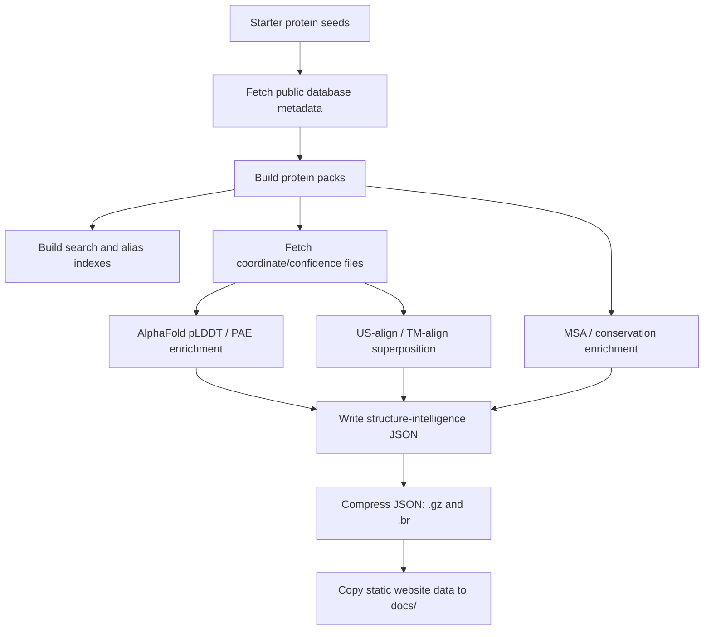

# BioAlign-Pro-Protein-Structure

[](https://github.com/sid0sid-ops/BioAlign-Pro-Protein-Structure/actions/workflows/deploy-pages.yml)
[](https://nextjs.org/)
[](https://sid0sid-ops.github.io/BioAlign-Pro-Protein-Structure/)
[](LICENSE)

BioAlign-Pro-Protein-Structure is a static-first protein structure research dashboard. It brings protein sequence, domain, structure, AlphaFold confidence, MSA conservation, ClinVar variant context, and source provenance into one browser-readable website.

The live deployment target is `docs/`, a complete standalone GitHub Pages website made from HTML, CSS, JavaScript, JSON, compressed data packs, indexes, and offline assets. The development app is built with Next.js, React, TypeScript, and Tailwind.

## What It Does

- Searches proteins by UniProt accession, gene name, aliases, PDB IDs, and common protein names.
- Loads saved starter protein packs first, so known records open quickly without repeated API calls.
- Shows canonical sequence, organism, UniProt ID, length, feature count, domains, structures, and source status.
- Displays experimental PDB structure records with a modern structure-viewer shell and expandable full viewer.
- Shows AlphaFold model confidence, pLDDT, PAE, confidence bins, and source links when the data exists.
- Shows sequence and domain annotation tracks with residue rulers and a full sequence modal.
- Shows UniProt feature records, domains, motifs, PTMs, binding sites, regions, disordered regions, and interaction regions.
- Computes and displays MSA/conservation only when real homolog sequence input and alignment output exists.
- Displays structure validation metrics only when coordinate superposition has been computed.
- Provides RMSD, TM-score, aligned length, Seq_ID, formulas, and a superposition metric graph when available.
- Fetches browser-side ClinVar/ClinicalTables variant data for a ClinVar-style protein-position graph when possible.
- Links directly to UniProt, UniProt Feature Viewer, UniProt variants, RCSB PDB, AlphaFold DB, InterPro/Pfam, ClinVar, and PDB-REDO.
- Exports JSON records, FASTA, feature CSV, and source lists.
- Uses IndexedDB, compressed static files, service-worker caching, predictive prefetching, and incremental rendering for smoother static use.

## Scientific Guardrail

The app does not invent biological measurements.

Unavailable values are not replaced by fake scores. MSA/conservation, pLDDT, PAE, RMSD, TM-score, and Seq_ID are shown only when the local static pack, public database response, or build-time computation provides them.

## Data Sources And APIs

| Source | Used For | Access Pattern |
| --- | --- | --- |
| UniProtKB REST API | canonical sequence, protein name, organism, gene, aliases, features, functional comments, variants link | build-time fetch and browser links |
| UniProt Feature Viewer | visual feature track for domains, PTMs, variants, AlphaMissense, structure coverage | external feature-viewer button |
| RCSB PDB REST/API and files | experimental structure records, PDB IDs, method, resolution, chains, coordinate files | build-time fetch and source links |
| AlphaFold DB API/files | predicted model mapping, CIF/PDB, pLDDT confidence, PAE matrix | build-time fetch and source links |
| InterPro / Pfam API | protein domains, families, repeats, profiles, motif evidence | build-time fetch and source links |
| ClinVar / NCBI E-utilities | clinical variant summaries and significance when parseable | browser fetch for variant graph |
| ClinicalTables ClinVar variants API | amino-acid change / protein-position fallback for ClinVar plotting | browser fetch fallback |
| PDB-REDO | structure-quality source link for PDB records | source link |
| Local WSL bio tools | MSA, conservation, coordinate superposition, structure validation | optional build-time enrichment |

## Starter Protein Packs

The static bundle includes selected proteins so the site can open important examples quickly:

TP53/p53, hemoglobin alpha, hemoglobin beta, EGFR, BRCA1, BRCA2, insulin, serum albumin, APP, tau, KRAS, HRAS, NRAS, ACE2, SARS-CoV-2 spike, actin, tubulin alpha, collagen alpha-1(I), and GFP.

## Main Interface

### Overview

Shows the selected protein identity:

- protein name
- gene name
- organism
- UniProt accession
- sequence length
- feature record count
- download actions

### Structure Route

Translates database evidence into a structure-biology workflow:

- primary structure: canonical amino-acid sequence
- secondary evidence: feature/domain/region records
- tertiary evidence: PDB and AlphaFold structures
- quaternary evidence: chains and assembly metadata
- route selection: experimental structure, homology modeling, threading/fold recognition, deep-learning model, validation

### Structures

Shows local or source-linked structure records:

- PDB ID
- title
- method
- resolution
- chains/assembly
- ligands when packaged
- compact structure view
- expanded full structure view
- source viewer links

### Domains

Shows InterPro/Pfam/UniProt domain and region records in a table:

- domain/region name
- residue range
- source database
- source record link

### Evolution

Shows MSA and conservation data when real alignment data exists:

- aligned homolog sequence count
- MSA method
- consensus sequence preview
- per-residue conservation score count
- aligned sequence table
- mean conservation

For TP53, the current enrichment pack contains a real 3-sequence TP53 vertebrate homolog alignment with 393 conservation scores.

### Sources

Shows source provenance:

- UniProtKB
- RCSB PDB
- AlphaFold DB
- InterPro/Pfam
- browser UniProt homolog search when used
- build-time pipeline artifacts when available
- offline static bundle links

## Graphs And Visualizations

### Sequence And Domain Annotation

Displays residue-position rulers, domain tracks, feature tracks, and sequence previews. The full sequence modal expands into a wider annotation record with:

- complete sequence
- block-wrapped sequence lines
- colored annotation map
- residue rulers
- region list
- click-to-highlight annotation behavior

### Structure Viewer

Displays the selected PDB/AlphaFold structure record in a simplified source-backed viewer shell. Expanding the viewer opens a larger modal and locks background scroll.

### AlphaFold Graphs

When AlphaFold confidence data is available:

- pLDDT profile graph
- pLDDT confidence-bin bars
- PAE heatmap
- mean pLDDT
- mean PAE
- low-confidence region count

### Structure Validation Graph

When coordinate superposition has been computed:

- aligned coverage
- RMSD quality
- TM-score
- Seq_ID

The validation panel also displays formulas:

```txt
RMSD = sqrt((1 / N) * sum_i ||x_i - y_i||^2)
TM-score = (1 / Ltarget) * sum_i 1 / (1 + (d_i / d0)^2)
Seq_ID = identical aligned residues / aligned residues
```

### ClinVar Variant Graph

The disease panel can show a ClinVar-style protein-position graph when browser API results include parseable residue positions. It groups variants into clinical-significance lanes:

- Pathogenic
- Likely pathogenic
- Uncertain significance
- Likely benign
- Benign
- Conflicting
- Not provided
- Other

If parseable records are not returned, the app shows the ClinVar link instead of fake points.

## Algorithmic Flow



## Build-Time Data Pipeline



## Algorithms Used

### Search And Query

- input normalization for accessions, PDB IDs, gene symbols, and FASTA-like sequences
- alias index lookup
- static search index lookup
- fuzzy search via Fuse.js
- browser API fallback when the record is not in the static pack

### MSA And Conservation

- build-time homolog sequence collection from curated starter data and UniProt-reviewed records
- MAFFT, Clustal Omega, or MUSCLE when available
- center-star global alignment fallback for curated homolog records
- consensus sequence from aligned columns
- residue conservation score = most frequent non-gap residue count / non-gap residue count
- conserved residue annotation from high-conservation positions and overlapping features

### Structure Validation

- coordinate file discovery from local static manifests
- AlphaFold predicted coordinate file versus experimental PDB coordinate file
- US-align or TM-align superposition
- parsed aligned length, RMSD, TM-score, and sequence identity over aligned residues
- values displayed only when the superposition result is actually packaged

### Incremental Loading And Prefetch

- feature tables and source tables render incrementally
- IntersectionObserver loads additional rows near the viewport
- route/data prefetch runs after link hover
- static bundles are cached in IndexedDB and by the service worker where possible

## Repository Structure

```txt
src/
  app/                         Next.js App Router pages and global styles
  components/structure-intelligence/
                               dashboard, sources, evolution, score and graph UI
  components/ui/               shared UI primitives
  hooks/                       incremental list and query helpers
  layouts/                     app shell, navigation, search bar
  lib/static-data/             static pack loaders, browser API fallback, IndexedDB cache
  lib/structure-intelligence/  structure scoring types and score utilities
  modules/query/               protein query workflow
  modules/visualization/       structure viewer gate

public/data/                   development static protein packs
public/data/structure-intelligence/
public/indexes/                search and alias indexes
public/models/                 browser runtime/model assets
public/offline-sw.js           offline service worker

docs/                          GitHub Pages deploy target
docs/assets/                   standalone CSS/JS
docs/data/                     static data copied for live site
docs/index.html                live static entry

scripts/
  fetch-public-data/           public API fetch and pack generation
  build-data/                  static data, coordinates, MSA, AlphaFold, validation enrichment
  verify-bio-tools.sh          WSL bio-tool verification
  run-wsl-data-build.ps1       Windows wrapper for WSL enrichment
```

## Development

Install dependencies:

```bash
npm install
```

Run the Next.js development app:

```bash
npm run dev
```

Open:

```txt
http://localhost:3000
```

Build the app:

```bash
npm run build
```

Typecheck:

```bash
npm run typecheck
```

Preview the GitHub Pages static site:

```bash
npm run preview:static
```

Open:

```txt
http://localhost:4173
```

## WSL Bioinformatics Enrichment

For full build-time bioinformatics enrichment on Windows, use WSL2 Ubuntu.

Recommended tools:

- MAFFT
- Clustal Omega
- MUSCLE
- Foldseek
- TM-align / US-align
- HMMER
- BLAST+
- MMseqs2
- DSSP
- BioPython
- Gemmi
- MDAnalysis

Verify tools inside WSL:

```bash
npm run data:verify-bio-tools
```

Run the Windows wrapper from PowerShell in the project folder:

```powershell
npm run data:build:wsl
```

Or run only enrichment:

```bash
npm run data:enrich-structure
```

## Static Deployment

The live site should deploy `docs/`.

GitHub Pages does not need a backend server, database, or Next.js runtime. The static site reads:

- `docs/index.html`
- `docs/assets/css/site.css`
- `docs/assets/js/app.js`
- `docs/data/**/*.json`
- `docs/indexes/**/*.json`
- compressed `.gz` and `.br` data files
- `docs/offline-sw.js`

The Next.js source remains the development code. The generated/static website in `docs/` is the deploy target.

## Downloads

The UI can export:

- full JSON record
- FASTA sequence
- feature CSV
- source list

## Current Limits

- GitHub Pages cannot run server-side bioinformatics tools.
- Browser-side ClinVar graph depends on public API availability and parseable protein-position fields.
- RMSD/TM-score requires both predicted and experimental coordinate files plus successful US-align/TM-align output.
- MSA/conservation requires real homolog sequences and a valid alignment result.
- Public APIs may change response shapes; source links are provided so records can be checked directly.

## License

MIT. See [LICENSE](LICENSE).
